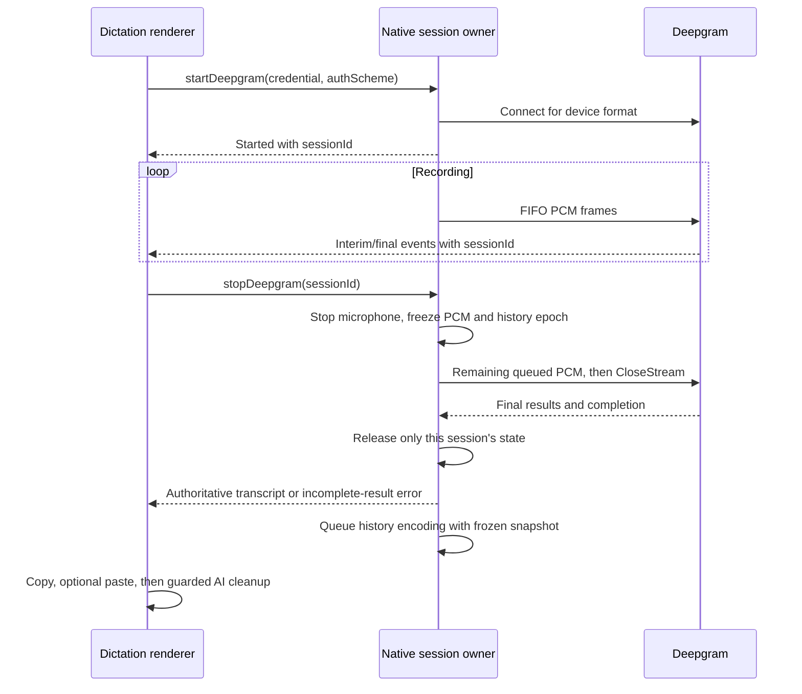

# Tauri backend architecture

Updated September 15, 2026 for the unreleased 1.0.9 fix branch. The [fix ledger](../docs/SECURITY_ARCHITECTURE_FIXES_2026-09-15.md) records validation and outstanding release gates. In this intermediate branch, client wiring for managed Deepgram grants still awaits explicit approval; BYOK is the working speech path.

## Runtime boundaries

MacroVox uses Tauri 2 with a Rust native process and two React webviews. `main` loads dictation.html and `settings` loads settings.html. They have separate React state and communicate through the typed Tauri event bridge. Both are declared in [tauri.conf.json](tauri.conf.json).

| Module | Responsibility |
| --- | --- |
| [lib.rs](src/lib.rs) | Plugins, windows, tray, global shortcut, setup, command registration |
| [commands.rs](src/commands.rs) | Validated native command boundary, capture/transcription orchestration, clipboard/paste, history API |
| [state.rs](src/state.rs) | Shared capture state, streaming ownership, settings, reusable HTTP client |
| [audio.rs](src/audio.rs) | CPAL capture, level calculation, PCM conversion, WAV encoding, capture limits |
| [deepgram_ws.rs](src/deepgram_ws.rs) | Authenticated WebSocket, bounded audio queue, result parsing, finalization |
| [voice_buffer.rs](src/voice_buffer.rs) | OGG/Opus storage, manifest transactions, retention, deletion, repair |
| [platform.rs](src/platform.rs) | OS and Wayland detection |
| [tauri-ipc.ts](../src/renderer/lib/tauri-ipc.ts) | Renderer command/event types and invoke wrappers |

`src/main/` is historical Electron code and is excluded from maintained builds. DictationMode owns the active renderer flow; the older standalone useDeepgram hook is not the live implementation. The Deepgram connection is established for each streaming recording, not prewarmed at application startup.

## IPC contract

A native command must appear both in `commands.rs` and `tauri::generate_handler!` in `lib.rs`, with a matching typed bridge export. JavaScript argument names use camelCase and native names use snake_case. Keep optional fields and serialized event names synchronized.

The main command families are audio device/capture, streaming start/stop, batch start/stop/cancel, optional Whisper, clipboard/paste, window/settings/theme, global shortcut, platform information, and history list/info/playback/save/delete/clear/reprocess/update.

Most simple mutations return `{ success, error? }`. A resolved promise is not proof of success. Clipboard and history callers must inspect `success` before displaying success, removing a row, or pasting.

Streaming start returns `sessionId`. Transcript and error events carry that same ID. Stop returns `success`, final `transcript`, `sessionId`, `duration`, optional `error`, and `limitReached`. An incomplete final result can retain useful text while returning an error; callers must show that limitation.

The stop response is authoritative. The renderer must not depend on the relative delivery order of a final event and an invoke response. It also buffers a small number of session-specific startup errors until it knows which session the start response created.

## Streaming lifecycle

An async start lock serializes connection setup. A short lifecycle mutex makes ownership checks and native state transitions atomic across start completion, stop, timeout cancellation, and worker cleanup. Never hold that standard mutex across a network await. The generation comparison and all related resource cleanup belong in the same critical section; comparing an ID and clearing fields later can erase a newer session.

Dropping the CPAL stream releases microphone capture. Normal stop and connection failure clear capture state and level, and remove the sender only while the exiting session still owns them. A timeout invalidates only its own session. Workers check ownership before continuing, so a canceled worker cannot spend minutes draining a slow FIFO or disturb a replacement.

The audio channel holds up to 1,000 messages, approximately ten seconds at ten-millisecond callback intervals. Backpressure is bounded and logged without audio or transcript contents. The connection has a 15-second timeout; individual socket writes are bounded. After CloseStream, final results are drained with a fixed eight-second deadline. Heartbeats or interim messages cannot reset that deadline. The command also bounds enqueue and completion waits.

Deepgram CloseStream already flushes pending audio. Sending it and immediately closing the WebSocket loses the final words. The drain routine accepts delayed final messages and stops at provider completion or closure, with explicit timeout/protocol errors. See [Deepgram CloseStream](https://developers.deepgram.com/docs/close-stream).

## Batch capture and memory

Batch Stop closes the microphone before credential acquisition or upload. The command takes an owned PCM snapshot, device sample rate/channels, language/keyword preferences, and history epoch before awaiting the provider. The reusable reqwest client bounds HTTP waits and can reuse connections.

Retained PCM is limited by five minutes of the actual device format and a 128 MiB sample-data ceiling, rounded to whole channel frames. This replaces the old fixed sample count that held only 50 seconds at 48 kHz stereo. A 60-second 48 kHz stereo recording fits. Reaching the cap sets `limitReached`; it is not silently reported as complete. Disabling the UI cutoff does not remove native storage bounds.

BYOK uses Deepgram Token authentication. Native commands also accept optional lowercase `bearer` authentication for short-lived managed grants. Omitted auth scheme defaults to Token for existing BYOK callers. Streaming, batch, and history reprocessing must all use the same credential convention. Nova-3 keyword boosting uses `keyterm`, not the older `keywords` query parameter.

Whisper remains behind the `local-stt` Cargo feature and requires a separately supplied model. Default tests do not validate that optional model runtime.

## History transactions and deletion

The history directory is under the app's local data directory, with OGG/Opus recordings and a JSON manifest. Capture and finalization take owned samples before a later recording can clear the shared capture buffer. Rust owns automatic streaming history persistence; the renderer must not make a second voiceBufferSave call for the same stopped session.

Encoding and file work run in blocking tasks. A transaction mutex covers complete manifest read/modify/write operations, including save, clear, deletion, transcript update, eviction, and startup repair. Atomic rename alone does not serialize competing updates.

Each directory also has a history epoch. Stop captures it before waiting for transcription. Clear increments it while holding the transaction lock. A queued older save checks its captured epoch and is rejected after Clear, preventing an already stopped recording from reappearing later.

Failed deletion does not remove the corresponding manifest entry. Clear and eviction preserve failures and return useful errors. The renderer keeps failed rows visible, refreshes list/storage information after partial clear, and allows deletion even when future history capture is disabled. Filenames are validated before filesystem access.

## Renderer coordination

Button, shortcut, and cutoff timer dispatch through the latest mode-aware handlers. Handler refs keep settings current without registering event listeners on every audio-level render. Recording mode is captured for the session so changing a preference does not route an active stream into batch Stop.

Transcript revisions and recording generations reject late stop or cleanup results after edits, Clear, auth changes, or a newer recording. Cleanup requests can be canceled, and concurrent work is counted rather than represented by one unreliable boolean. Cleanup may update the current clipboard; it does not rewrite text already pasted into another application.

Auth listeners run in both webviews. Stale account loads are rejected and identity changes clear managed access. Token refresh for the same user does not invalidate an active recording. Stop remains available after sign-out or key removal. Failed/stale starts dispose native resources.

The updater is mounted once in the dictation webview. Installation and restart require the user's explicit action. Published 1.0.8 clients did not mount that updater and need a manual installer upgrade.

## Security and platform limits

Production CSP has one source, `app.security.csp` in tauri.conf.json. Do not add another HTML meta policy. It pins the Supabase project and provider/site origins, permits Anthropic BYOK requests, and permits data-URL audio playback. `npm run check:csp` checks these contracts. Custom Supabase deployments must update the exact CSP origin.

Windows uses the existing `http://tauri.localhost` custom-protocol origin. The approved server CORS allowlists include it exactly; remote service requests still use HTTPS. Do not flip `useHttpsScheme` as a CORS workaround, because it changes where the webview finds stored sessions/settings. See [Tauri configuration](https://v2.tauri.app/reference/config/#usehttpsscheme).

Shared provider master keys belong on the hosted backend. Supabase service-role operations own entitlement, trial, webhook, and quota mutations. See the [backend migration runbook](../docs/BACKEND_SECURITY_MIGRATION_2026-09-15.md). Temporary grant issuance is not enforceable audio-minute metering: an established provider connection can outlive its grant's authentication TTL.

BYOK keys and Supabase sessions currently persist in webview localStorage. OS credential storage remains a hardening task. The AudioStream Send/Sync wrapper and platform behavior require care when changing capture libraries. Mutex poisoning uses recovery where the current code does so; do not assume every lock is infallible.

On Wayland, native paste and global shortcuts have platform limitations. Clipboard copy remains available. Windows test results do not establish Linux runtime compatibility.

## Validation and release

Run renderer/hosted tests and types, build contracts, native formatting/tests/clippy, Deno checks/tests, database integration, and dependency audits as documented in CI and the fix ledger. Native tests cover finalization streams, timeout/error behavior, session ownership, format-aware buffering, history concurrency, and failed/queued deletion scenarios.

No automated test here replaces a real microphone test, a packaged WebView check of BYOK/history playback, or a signed upgrade test. The release checklist requires each before publication. Do not claim an end-to-end latency improvement from the local synthetic encoding benchmark alone.
